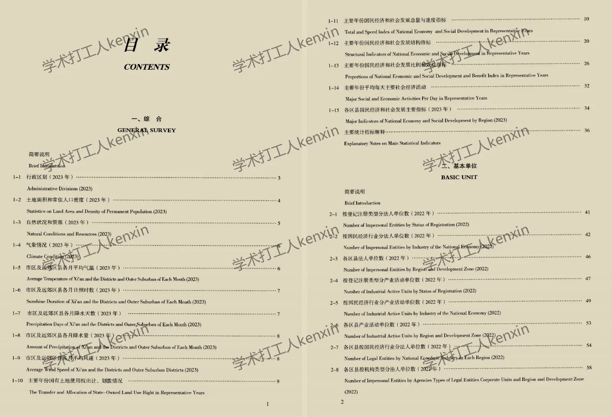
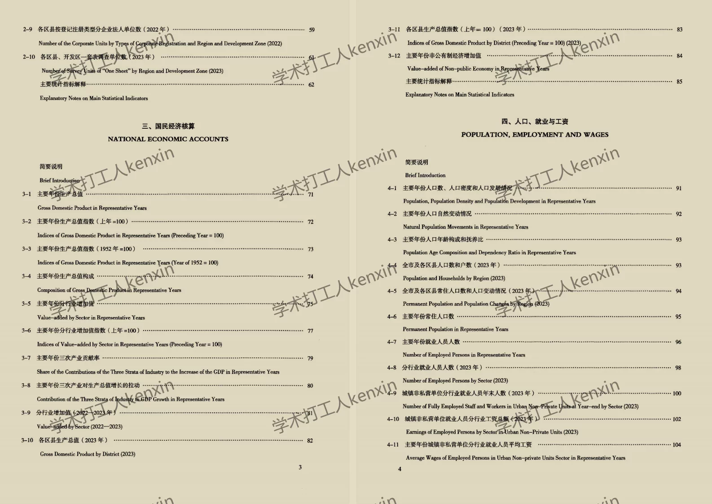
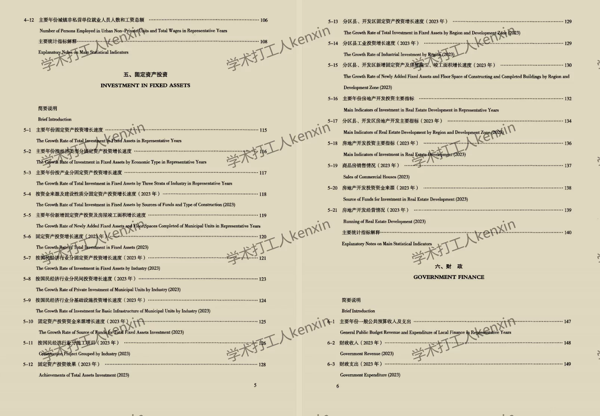
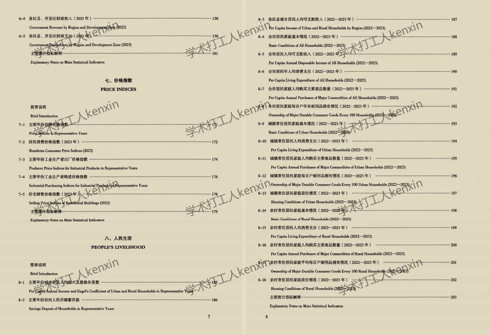
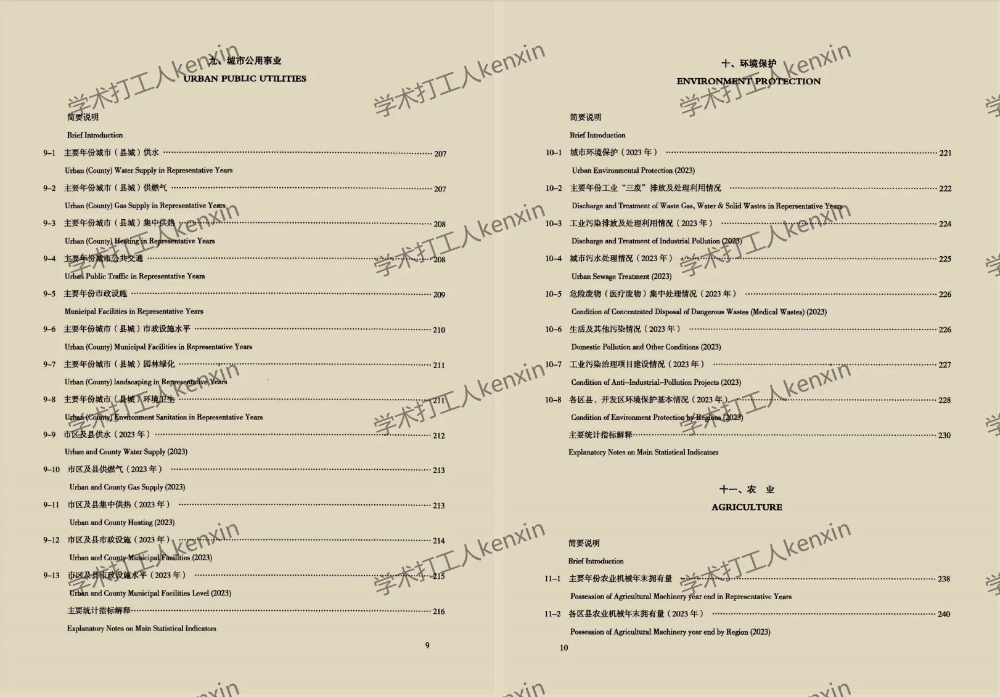
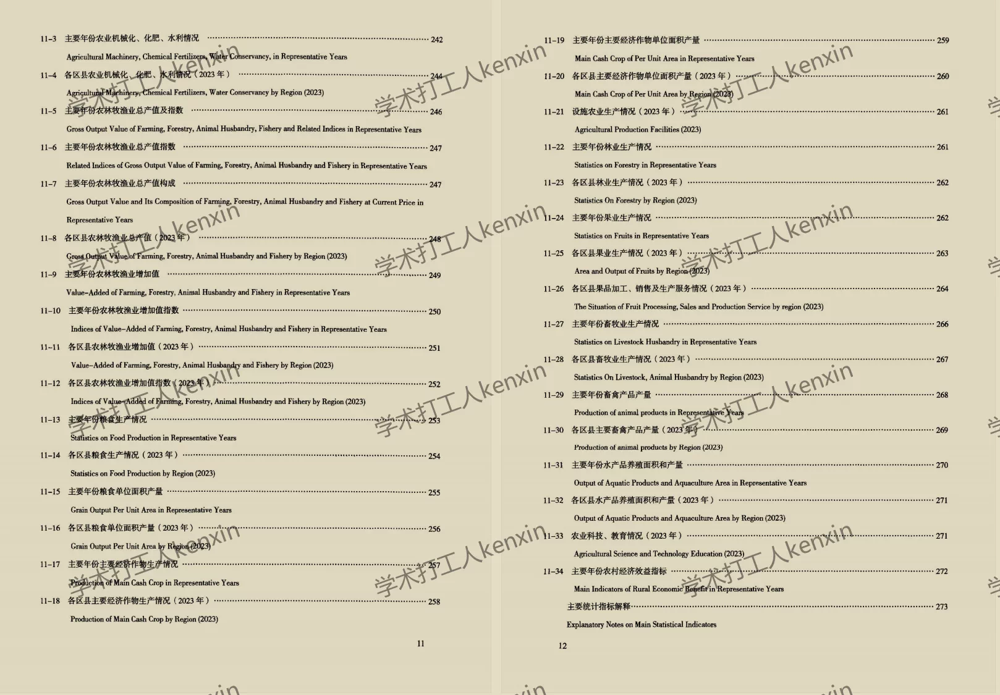
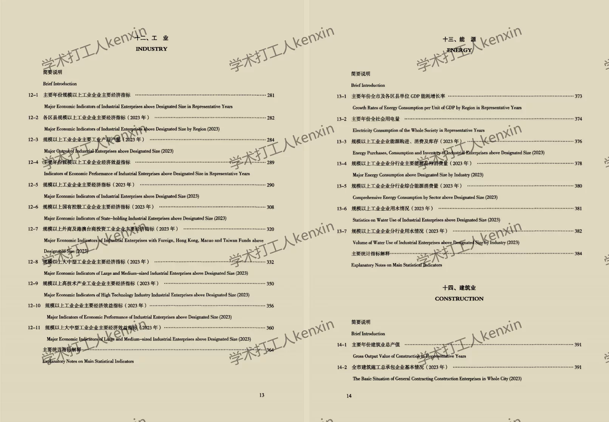
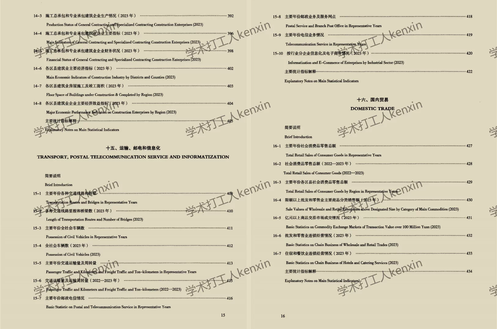

## Body

"Xi'an City Statistical Yearbook" (2008-2024)

Data Year: The title year is the year of data compilation, so the data year needs to be one less than the title year.
Please check the image below before purchasing! The complete display instructions are provided, please confirm if you need it before purchasing! No returns or exchanges after shipment!

01. Data Introduction
"Xi'an City Statistical Yearbook" (2008-2024)

02. Indicator Details
(1) The directory is displayed in the image, please view it on your own and make a purchase accordingly. If you need help finding specific indicators, they are all here. After shipment, there will be no return or exchange without any reason.
(2) The display directory is for 2024, due to limited space, only some parts are shown. The statistical standards may change from year to year. Academic common sense, the data year recorded in statistical materials is the previous year's data, which is also an academic common sense, please note.
(3) The Excel format data is organized from original materials, including the content of the original material data but not the text content.
(4) If the data is placed in a zip file, you need to save the zip file first, then download, then unzip.
(5) If there is Excel protection, you can select all and copy to a new sheet to use.

03. Data Format
2018-2023: Excel
2024: PDF

## Images

Here is a pay link on Stripe ( https://buy.stripe.com/3cs8yP7sY87d0vu9AB ). Please contact me lonlonago@foxmail.com after funding $89, and I will send you a complete data files , thank you!

